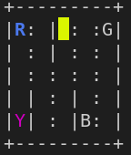

# Autonomous Taxi Cab

Esse projeto consiste de um agente autônomo para resolver o problema do [Taxi Cab](https://gym.openai.com/envs/Taxi-v3/) da OpenAI. O problema consiste em um "tabuleiro" gerado aleatoriamente, onde é colocado um motorista de taxi (retângulo amarelo), um passageiro (localizado em uma das letras em azul) e um destino (localizado em uma das letras em lilás), como na figura abaixo:



As únicas ações possíveis são codificadas para serem passadas para o agente e são:

| Código |   Ação  |
| ------ | ------- |
|   0    |  South  |
|   1    |  North  |
|   2    |  East   |
|   3    |  West   |
|   4    | Pickup  |
|   5    | Dropoff |

Dessa forma, o agente utiliza de uma heurística baseada em Distância Euclidiana entre sua posição e o destino (passageiro se o passageiro ainda não está no carro, ou destino se já está) e, utilizando o algoritmo A* encontra sempre uma solução ótima para completar o objetivo.

## Setup do ambiente para execução do agente

Configure um ambiente virtual:

```
python3 -m virtualenv venv
source venv/bin/activate
```

Instalando dependências:

```
python3 -m pip install --upgrade pip
pip install -r requirements.txt
```

Execute o main.py e você deve visualizar o estado inicial e uma sequência de passos caso seja possível achar o caminho ou a mensagem "Não soube encontrar a solução".

## Raciocínio do Código

Para conseguir uma solução ótima em uma ordem de segundos foram combinadas duas estratégias.

A primeira é podar a árvore de possibilidades e isso pode ser feito de três maneiras:

- Criar apenas um estado com a ação de Pickup caso o passageiro não esteja no taxi e as coordenadas do passageiro e taxi forem a mesma;
- Criar apenas um estado com a ação de Dropoff caso o passageiro esteja no taxi e as coordenadas do destino e taxi forem a mesma;
- Do contrário, criar sucessores para os movimentos possíveis e por possível significa que o taxi não esbarra em um obstáculo e nem reproduz um movimento que o faça voltar a configuração anterior.

A segunda estratégia é utilizar uma heurística forte, com menos repetição, no caso a distância euclidiana e utilizar o algoritmo A*, já que esse leva em consideração o custo que pode ser visto como o número de passos do taxi. Isso é útil para evitar que ele ache um ponto de heurística baixa e fique circulando em volta desse.
